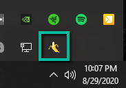

# Banana Peel

## Slippi Replay Watcher/Uploader

## Getting Started

1) Download the [latest release](https://github.com/andrew-brainerd/banana-peel/releases/download/v0.3.0/banana-peel-Setup-0.3.0.exe) of Banana Peel

2) Install the application from `banana-peel-Setup-0.3.0.exe`

3) Click on the 'Banana Peel' icon in the system tray

   

4) Drag your `user.json` file from Slippi onto the application window to set your username

   

5) Set your replay path to match whereever you store your Slippi replays (this can be configured in the Dolphin settings)

   